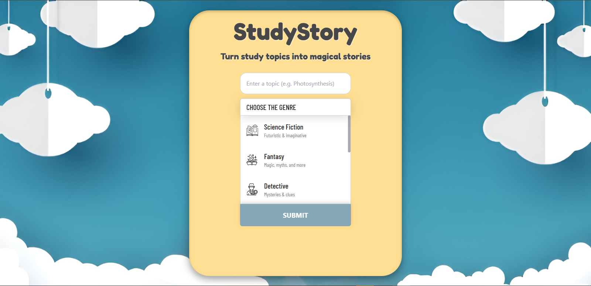
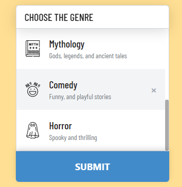
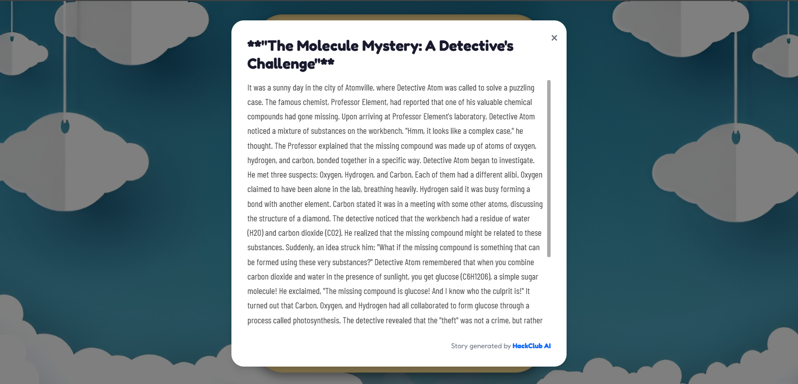

# 📚✨ StudyStory – Turn Study Topics into Magical Tales

Welcome to **StudyStory**, a unique web app that transforms boring study topics into enchanting, genre-based stories using AI. Whether you're a student, teacher, or a curious learner, StudyStory adds a magical twist to your learning journey.

---

## 🌟 What is StudyStory?

**StudyStory** is a fun, AI-powered storytelling platform that:
- Converts educational topics into fictional stories
- Lets you choose from exciting genres like **Fantasy**, **Detective**, **Mythology**, and more
- Brings learning to life through **creative narration**

---

## 🧩 Key Features

- 🧠 **AI-Powered Generation** – Uses advanced language models to build immersive stories from your input.
- 🎨 **Genre Selection** – Choose a theme for your story: Fantasy, Sci-Fi, Adventure, Horror, etc.
- ✍️ **Live Typing Effect** – Watch the story unfold one letter at a time like a typewriter.
- ✅ **Smart Feedback** – Instant prompts for missing inputs (e.g., topic or genre).
- 💬 **Clean UX** – Vibrant colors, animated inputs, and polished UI using Tailwind CSS.
- 💚 **Responsive Design** – Works beautifully on desktop.

---

## 🧪 Tech Stack

- **Frontend**: HTML, Tailwind CSS, JavaScript
- **Backend**: Node.js + Express (deployed on Render)
- **Hosting**: Vercel (Frontend) + Render (API)
- **AI API**: HackClub AI

---

## ⚙️ How to Use

1. **Enter a Topic** – Example: *Photosynthesis*
2. **Choose a Genre** – Example: *Fantasy*
3. **Click Submit** – A magical popup opens with your story.
4. 📖 Read or listen to your story (TTS coming soon!)

---

## 📸 Screenshots

---

## 📹 Video Preview

[▶️ Watch the demo](https://drive.google.com/file/d/1o3yKyW95lHwSJiBPYvw2gk7SVYonrNPZ/view?usp=sharing)

---

## 🧠 Use Cases

- ✏️ Students learning new concepts creatively
- 📚 Teachers explaining topics with storytelling
- 🧙 Parents helping kids study with magic
- 💻 Hackathons, Portfolios, and Educational Startups
---

## 💡 What's Next?

- 📢 **AI Voice Narration via Microsoft Azure TTS**
- 🌍 **Language Options (Hindi, Spanish, French, etc.)**
- 🔖 **Save Story as PDF**
- 🧙‍♀️ **Character/Theme Customization**

---

## 🚀 Live Demo

🔗 [Try StudyStory Live!](https://study-story.vercel.app/)

---

## 🤝 Want to Contribute?

1. Fork the repo
2. Create a new branch
3. Submit a pull request  
Contributions welcome: bug fixes, feature ideas, new genres, and animations!  

---

## 📬 Connect with Me

---

## 🙌 Special Thanks

Huge gratitude to **Hack Club** for their open AI tools that power this magical experience.

---

## 🌟 Thank You!

Dive into the world of imagination.
Study smarter. Learn creatively. Live magically.
